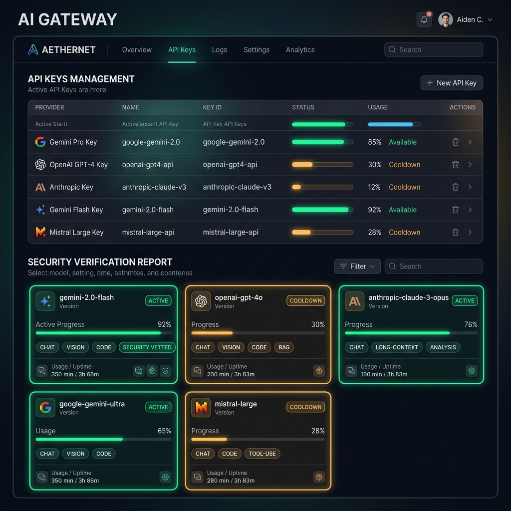

# 🗝️ AI Key Manager (Hybrid AI Gateway)



[](https://opensource.org/licenses/MIT)
[](#security)
[](#-architecture)

**A high-performance, browser-native AI Gateway for resilient LLM integration.** 
Stop hardcoding model IDs. Manage multiple keys, automate failovers, and optimize routing—all with zero backend.

---

## 🚀 Why AI Key Manager?

Integrating LLMs is easy, but building a **production-grade gateway** with rate-limit handling, provider failover, and model cost-optimization is hard. This library provides a hardened, deterministic routing engine that runs entirely in your user's browser.

-   **Hybrid AI Gateway**: Strict separation between *Routing Policies* (abstract models like `smart`) and *Key Resolution* (physical API keys).
-   **Effective Score Engine**: Real-time routing based on **Power Score**, **Health Bonus**, and **Latency Penalties**.
-   **Zero Backend Required**: Hardened security using Web Crypto API and AES-256-GCM.
-   **Sticky Routing**: Session-level persistence for consistent model/key pairs and context integrity.
-   **Auto-Recovery**: Background `RetryScheduler` with exponential backoff for rate-limited or degraded keys.

---

## 🏗️ Architecture: The Hybrid Gateway

Unlike simple wrappers, this system acts as a true gateway:

1.  **Routing Policy Layer**: Resolves an abstract alias (e.g., `smart`) into a prioritized chain of physical models (e.g., `gpt-4o` → `claude-3-5-sonnet`).
2.  **Availability Cache**: A high-performance, in-memory layer that tracks the real-time health and "Effective Score" of every key/model pair.
3.  **Key Resolver**: Picks the highest-scoring physical key for the selected model in $O(1)$ time.

---

## ✨ Core Capabilities

### 🛡️ [Hardened Security](./docs/features/security.md)
API keys are encrypted using **AES-256-GCM** before being saved to IndexedDB. They never leave the client and are only decrypted in-memory during active requests.

### 🚦 [Effective Score Routing](./docs/features/routing.md)
Deterministic selection using a multi-factor formula that ensures you always use the best available key:
`Score = Power + Priority_Bonus + Health_Bonus - Latency_Penalty`

-   **Power Score**: Base intelligence ranking (e.g., `o3`=100, `gpt-4o`=80, `gemini-pro`=85).
-   **Priority Bonus**: User-defined tiering (`+20` for High, `-20` for Low).
-   **Health Bonus**: Reward for consistent uptime; failure results in immediate heavy penalties.
-   **Latency Penalty**: Real-time optimization; subtracts `1` point for every 10ms of average latency.

### 🔄 [Resilient Failover](./docs/unified-api-flow.md)
If a provider returns a `429` or `5xx`, the gateway transparently rotates to the next best key or fallback model in the chain without interrupting the user.

### 📊 [Real-time Monitoring](./examples/ui-demo/)
A premium dashboard component for monitoring key health, model availability, and background retry schedules in real-time.

---

## 🛠️ Quick Start

### 1. Setup

```bash
# Clone and setup
git clone https://github.com/sunshine12396/llm-key-manager.git
cd llm-key-manager
make setup

# Run the UI Monitoring Dashboard
make ui-demo
```

### 2. Basic Usage (React)

```tsx
import { LLMKeyManagerProvider, useLLM } from 'llm-key-manager';

function App() {
  const { chat, isLoading } = useLLM();

  const handlePrompt = async () => {
    // Uses Routing Policy 'smart' -> auto-resolves best key/model
    const response = await chat({
      model: 'smart',
      messages: [{ role: 'user', content: 'Explain quantum computing.' }]
    });
    console.log(response.content);
  };

  return <button onClick={handlePrompt}>Ask AI</button>;
}
```

---

## 📖 Documentation

-   [**Unified API Flow**](./docs/unified-api-flow.md) - Deep dive into request execution.
-   [**Developer Guide**](./docs/DEVELOPMENT.md) - Internal architecture and lifecycle.
-   [**Smart Routing**](./docs/features/routing.md) - The Effective Score formula.
-   [**Discovery & Health**](./docs/features/discovery.md) - Background validation logic.
-   [**Model Management**](./docs/features/models.md) - Fallback chains and aliases.

---

## 🛡️ License

Distributed under the MIT License. See `LICENSE` for more information.
