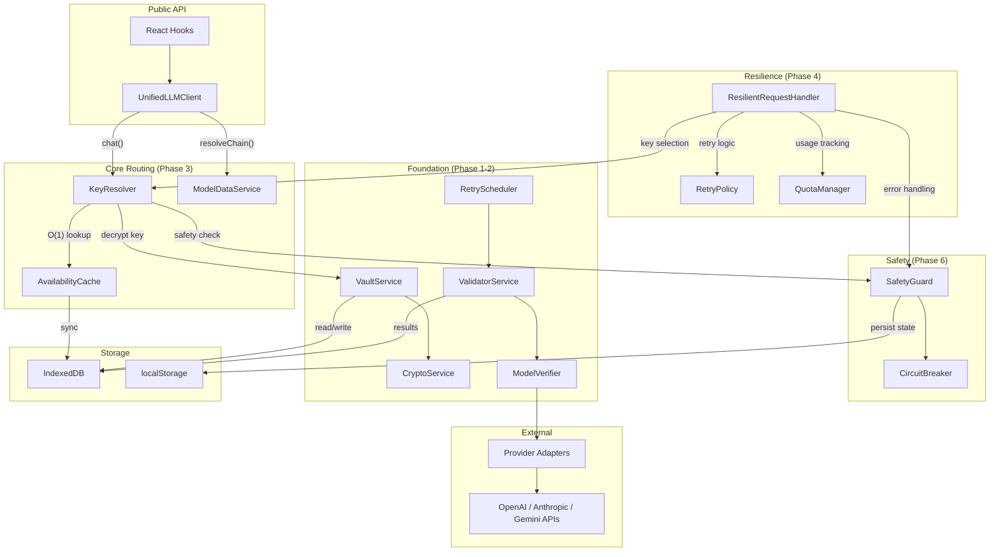

# System Architecture

The AI Key Manager is a **browser-native Hybrid AI Gateway** — a client-side library that provides production-grade LLM routing, failover, and key management without requiring a backend server.

## Design Principles

1. **Zero Backend**: All logic runs in the browser. Keys never leave the client.
2. **Policy ↔ Protocol Separation**: Routing decisions (which model) are strictly decoupled from key selection (which API key).
3. **O(1) Hot Path**: The `AvailabilityCache` ensures request routing never touches IndexedDB on the critical path.
4. **Graceful Degradation**: Every layer has a fallback — model chains, key rotation, circuit breakers, and emergency mode.

## Module Dependency Graph



## Request Lifecycle

```
1. chat({ model: "smart" })
   │
2. ├── resolveChain("smart") → ["gpt-4o", "claude-3-5-sonnet", "gemini-2.0-flash"]
   │
3. ├── For each model in chain:
   │   ├── keyResolver.resolve(model)
   │   │   ├── SafetyGuard check (provider/key disabled? circuit open?)
   │   │   ├── AvailabilityCache.getUsableModels(provider)
   │   │   ├── Filter by model match + exclude failed keys
   │   │   ├── Sort by Effective Score (descending) + deterministic tie-break
   │   │   └── Return highest-scoring key (with sticky preference)
   │   │
   │   ├── adapter.chat(apiKey, request)
   │   │
   │   ├── On Success:
   │   │   ├── Update sticky cache
   │   │   ├── Mark model AVAILABLE
   │   │   ├── Record analytics
   │   │   └── Return response
   │   │
   │   └── On Failure:
   │       ├── Classify error (429=TEMP, 401/403=PERM, 5xx=TEMP)
   │       ├── Update state machine + circuit breaker
   │       ├── Add key to excludeSet
   │       └── Try next key (or next model in chain)
   │
4. └── All exhausted → throw LLMError
```

## Key Abstractions

| Abstraction | Purpose | Location |
|:-----------|:--------|:---------|
| `IProviderAdapter` | Standardized interface for all LLM providers | `src/providers/types.ts` |
| `ModelStateMachine` | Formal state transitions for (key, model) pairs | `src/services/availability/state-machine.ts` |
| `AvailabilityCache` | In-memory O(1) lookup with multi-index | `src/services/availability/availability.cache.ts` |
| `SafetyGuard` | Unified safety controls (circuits, disable, emergency) | `src/services/safety/safety-guard.ts` |
| `LLMKeyManagerProvider` | React context providing hooks to all services | `src/components/core/LLMKeyManagerProvider.tsx` |
