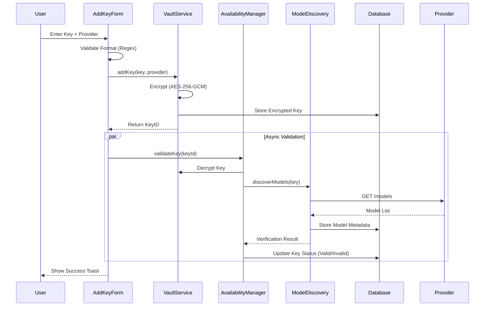
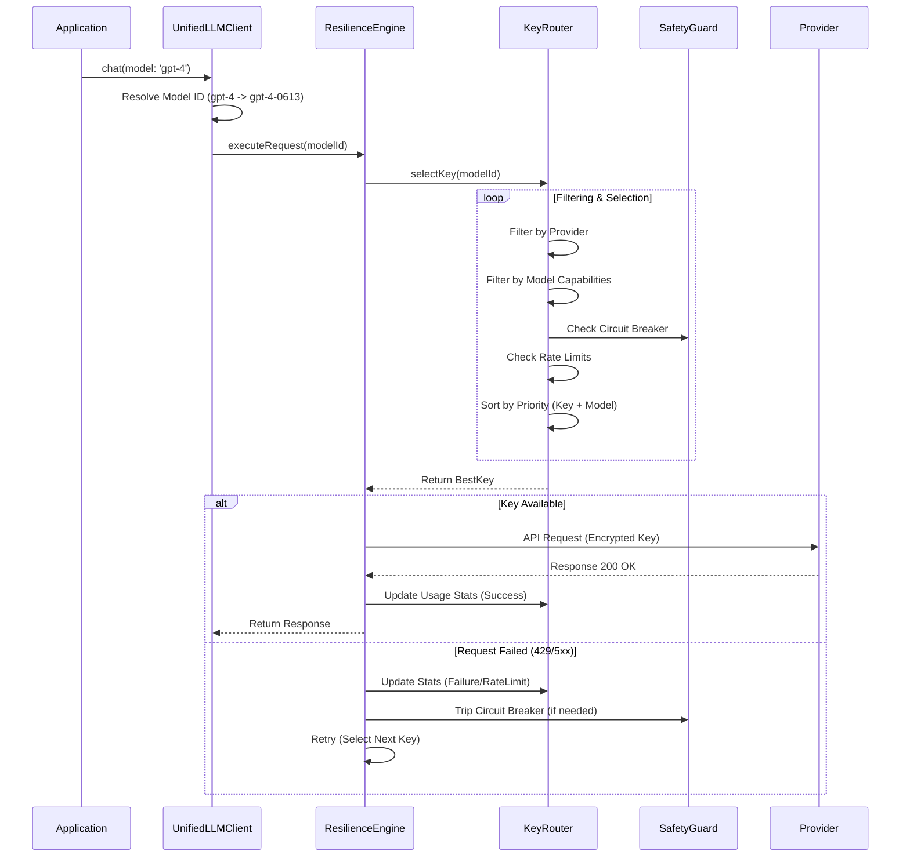

# AI Key Manager Module (Client-Only)

**Description:** An open-source library for secure, browser-only API key management for AI providers. Fully supports **Google Gemini**, **OpenAI**, and **Anthropic Claude**. All data is stored locally in the browser (no server, no cloud sync), ensuring maximum privacy and user control.

## ✨ Core Capabilities

### 1. Advanced API Key Management
- **Multi-Key Support:** Add, edit, and delete multiple API keys per provider.
- **Search & Filtering:** Instantly find keys by label or provider with real-time filtering.
- **Dual-Level Priority:** Smart priority system managing both **Key Priority** (High/Medium/Low) and **Model Priority** (1-5) for granular control.
- **Bulk Actions:** Delete multiple keys simultaneously for easier management.

### 2. Secure Client-Side Storage
- **Encryption:** API keys are encrypted using **AES-256-GCM** (via Web Crypto API) before storage.
- **Local Storage:** Uses browser-native secure storage (IndexedDB).
- **Zero Leakage:** No plaintext keys are ever persisted; no data ever leaves the client.

### 3. Smart Health & Capability Discovery
- **Background Validation:** Asynchronously validates key authenticity without blocking the UI.
- **Advanced Discovery:** Query available models with rich filters by **Priority**, **Capabilities** (e.g. Chat, Embedding), and Provider.
- **Model Discovery:** Automatically queries providers to list exactly which models a key can access (supporting modern models like **gpt-4.5**, **o3**, and **gemini-2.5-flash**).
- **Real-time Monitoring:** Detects expired, disabled, or revoked keys instantly.
- **Tier Detection:** Infers usage tiers (Free vs Pro) based on rate limits.

### 4. Centralized Model Management
- **Alias System:** Use logical aliases like **Fast**, **Smart**, **Balanced**, **Coding**, and **Reasoning** to decouple application logic from specific model versions.
- **Fallback Chains:** Robust multi-model fallback sequences (e.g., falling back from `gpt-4.5` to `o3` to `gemini-1.5-pro`) to ensure high availability even during provider outages.

### 5. Unified API Interface
- **Provider Agnostic:** Exposes a single, unified API interface for all providers.
- **Smart Selection:** Automatically selects the correct provider, compatible model, and best available API key.
- **Abstraction:** Hides provider-specific complexities directly from the consumer.

### 6. Auto-Switching & Priority Routing
- **Failover Protection:** Automatically switches keys on Rate Limited (429), Quota Exceeded, or temporary service failures.
- **Smart Routing:** Routes requests based on key priority, availability, and recent failure history.

### 7. Robust Error Handling
- **Exponential Backoff:** Built-in retry strategy to handle transient errors gracefully.
- **Smart Classification:** Distinguishes between retryable and non-retryable errors to prevent retry storms.

### 8. Usage Analytics & Cost Estimation
- **Request Tracking:** Visualizes request volume over time via the **UsageDashboard**.
- **Cost Estimator:** Client-side calculation of estimated costs based on token usage.
- **Error Logs:** Detailed history of failed requests for debugging, accessible via the **ErrorLogs** view.

### 9. Pro-Level UI & UX
- **Glassmorphism Design:** Modern, translucent UI with smooth animations.
- **Responsive:** Fully adaptive layout for mobile and desktop.
- **Micro-interactions:** Interactive hover states and loading indicators.
- **Zero-Config Components:** Drop-in React components like **KeyListDashboard** and **AddKeyForm**, ready for production use.

## ⚙️ Configuration & Extensibility
- **Centralized Configuration:** All providers and models are defined in centralized JSON files (`models.json`, `providers.json`), allowing for easy updates to tiers and availability without code changes.
- **Extensible Architecture:** Easily add new providers or models by updating the JSON configuration.

## 🧠 Supported Providers
- **Google Gemini** (AI Studio)
- **OpenAI** (Platform)
- **Anthropic Claude** (Workbench)
- _Architecture is extensible for future providers_

## 🛡️ Design Principles
- **Client-Only:** No backend required; works entirely in the browser.
- **Privacy-First:** Zero telemetry; your keys stay on your device.
- **Deterministic Routing:** Predictable and transparent key selection.
- **Safe Failure:** Designed to never leak keys, even during error states.

## 🧪 Testing Scope
- **Integration Test:** Build a chat application to apply the auto-switching of API keys and models under real-world scenarios.

## 🔄 Core Workflows

### 1. Key Addition & Verification Flow
This process ensures that every key added to the system is securely encrypted, validated, and its capabilities are fully discovered before it is used.

### 2. Unified API Request & Routing Flow
The critical path for how the `UnifiedLLMClient` selects the best possible key for a request, handling failovers and load balancing automatically.

